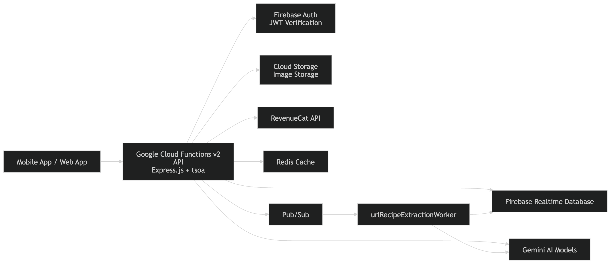
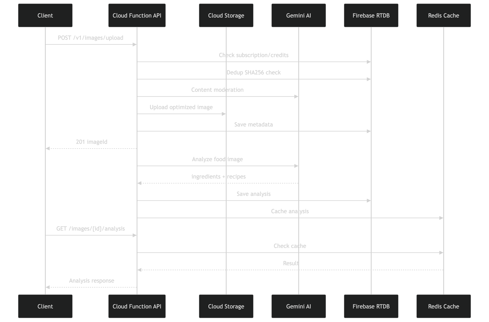
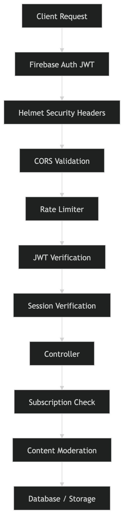

# Architecture Overview

## System Overview



```
Clients (Mobile App / Web App)
    │
    ▼
┌──────────────────────────────────────────────┐
│  Google Cloud Functions v2 (us-central1)     │
│                                              │
│  ┌──────────────────────────────────────┐    │
│  │ api (HTTP)                           │    │
│  │ Express.js + tsoa (OpenAPI)          │    │
│  │ 1 GiB RAM · 5 min timeout           │    │
│  └──────────┬───────────────────────────┘    │
│             │                                │
│  ┌──────────▼───────────────────────────┐    │
│  │ Middleware Stack                      │    │
│  │ Sentry → Helmet → CORS → Multer →   │    │
│  │ JSON parser → Rate limiter → tsoa    │    │
│  │ auth (Firebase JWT)                  │    │
│  └──────────┬───────────────────────────┘    │
│             │                                │
│  ┌──────────▼───────────────────────────┐    │
│  │ Controllers (tsoa)                   │    │
│  │ Auth · Image · Asset · Preference ·  │    │
│  │ RecipeUrl · Subscription · Webhook   │    │
│  └──────────────────────────────────────┘    │
│                                              │
│  ┌──────────────────────────────────────┐    │
│  │ urlRecipeExtractionWorker (Pub/Sub)  │    │
│  │ 1 GiB RAM · 5 min timeout           │    │
│  │ Subscribes: url-recipe-extraction    │    │
│  └──────────────────────────────────────┘    │
└──────────────────────────────────────────────┘
    │              │              │
    ▼              ▼              ▼
┌────────┐  ┌───────────┐  ┌──────────────┐
│Firebase│  │  Cloud     │  │  Google       │
│ RTDB   │  │  Storage   │  │  Gemini AI   │
└────────┘  └───────────┘  └──────────────┘
    │              │
    ▼              ▼
┌────────┐  ┌───────────┐
│ Redis  │  │ RevenueCat│
│ Cache  │  │   API     │
└────────┘  └───────────┘
```

---

## Cloud Functions

| Function                    | Trigger | Memory | Timeout | Max Instances | Purpose                        |
| --------------------------- | ------- | ------ | ------- | ------------- | ------------------------------ |
| `api`                       | HTTP    | 1 GiB  | 300s    | 10            | Main REST API (Express + tsoa) |
| `urlRecipeExtractionWorker` | Pub/Sub | 1 GiB  | 300s    | 10            | Async URL recipe extraction    |

---

## AI Models (Google Gemini)

| Model                      | ID                       | Purpose                               |
| -------------------------- | ------------------------ | ------------------------------------- |
| **Gemini 3 Flash Preview** | `gemini-3-flash-preview` | Food analysis + URL recipe extraction |
| **Gemini 2.0 Flash**       | `gemini-2.0-flash`       | Content moderation (safety checks)    |

- **Analysis model** sends multimodal input (images or video URLs) and returns
  structured JSON
- **Moderation model** is cheap/free-tier eligible, used only for binary safety
  classification

---

## API Endpoints

| Controller             | Route Prefix                                  | Purpose                                                            |
| ---------------------- | --------------------------------------------- | ------------------------------------------------------------------ |
| HealthController       | `/`                                           | Health check                                                       |
| AuthController         | `/v1/auth`                                    | Signup, login, Google sign-in, profile, email verification, logout |
| ImageController        | `/v1/images`                                  | Upload image, get analysis, list images, signed URLs               |
| RecipeUrlController    | `/v1/recipes`                                 | Extract recipes from URLs, get extraction status                   |
| PreferenceController   | `/v1/food-preferences` `/v1/user/preferences` | Manage user food preferences                                       |
| GroceryController      | `/v1/grocery`                                 | Grocery list operations                                            |
| IngredientController   | `/v1/ingredients`                             | Ingredient operations                                              |
| SubscriptionController | `/v1/subscription`                            | RevenueCat subscription management                                 |
| WebhookController      | `/v1/webhooks`                                | RevenueCat webhook handling                                        |
| AssetController        | `/v1/assets`                                  | Unified list of all images                                         |

All endpoints except health require **Bearer auth** (Firebase Auth JWT). OpenAPI
docs auto-generated at `/swagger`.

---

## Request Flows

### Image Upload + Analysis (Synchronous)



```
Client                     api Cloud Function                 Cloud Storage    Gemini AI        RTDB
  │                              │                                │               │              │
  ├── POST /v1/images/upload ──► │                                │               │              │
  │   (image file)               │                                │               │              │
  │                              ├── Check subscription/credits ──────────────────────────────────►│
  │                              │   (atomic: verify available)   │               │              │
  │                              │                                │               │              │
  │                              ├── SHA-256 dedup check ────────────────────────────────────────►│
  │                              │                                │               │              │
  │                              ├── Sharp: optimize/resize       │               │              │
  │                              │                                │               │              │
  │                              ├── Content moderation ─────────────────────────► │              │
  │                              │   (Gemini 2.0 Flash)           │               │              │
  │                              │                                │               │              │
  │                              ├── Upload optimized image ────► │               │              │
  │                              │                                │               │              │
  │                              ├── Save metadata ──────────────────────────────────────────────►│
  │                              │                                │               │              │
  │ ◄── 201 {imageId, status} ──┤                                │               │              │
  │                              │                                │               │              │
  │                              │  [Background - no wait]        │               │              │
  │                              ├── analyzeFoodImage() ─────────────────────────►│              │
  │                              │   (Gemini 3 Flash Preview)     │               │              │
  │                              │   Returns ingredients + recipes│               │              │
  │                              │                                │               │              │
  │                              ├── Save analysis ──────────────────────────────────────────────►│
  │                              │   + cache in Redis             │               │              │
  │                              │                                │               │              │
  ├── GET /images/{id}/analysis ►│ ◄── poll until completed ─────────────────────────────────────►│
```

### URL Recipe Extraction (Pub/Sub Async)

```
Client              api Cloud Function      Pub/Sub          urlRecipeWorker          Gemini AI      RTDB
  │                       │                    │                     │                     │             │
  ├── POST /recipes/extract-from-url►│         │                     │                     │             │
  │   {url}               │                    │                     │                     │             │
  │                       ├── Check subscription/credits ────────────┼─────────────────────┼────────────►│
  │                       │                    │                     │                     │             │
  │                       ├── URL validation   │                     │                     │             │
  │                       │                    │                     │                     │             │
  │                       ├── SHA-256 URL dedup check ───────────────┼─────────────────────┼────────────►│
  │                       │                    │                     │                     │             │
  │                       ├── Save metadata ───┼─────────────────────┼─────────────────────┼────────────►│
  │                       │                    │                     │                     │             │
  │                       ├── Publish ────────►│ url-recipe-extraction│                     │             │
  │                       │   {urlId, url}     │                     │                     │             │
  │                       │                    │                     │                     │             │
  │◄── 201 {urlId} ──────┤                    │                     │                     │             │
  │                       │                    ├── Trigger ─────────►│                     │             │
  │                       │                    │                     │                     │             │
  │                       │                    │                     ├── Extract recipe ──►│             │
  │                       │                    │                     │   (YouTube: fileData│             │
  │                       │                    │                     │    Others: URL Context)           │
  │                       │                    │                     │                     │             │
  │                       │                    │                     ├── Save result ─────────────────►│
  │                       │                    │                     │   + shared dedup    │             │
  │                       │                    │                     │                     │             │
  ├── GET /recipes/url/{urlId} ► poll until completed ───────────────────────────────────────────────►│
```

---

## Subscription & Credit System

The app uses **RevenueCat** for subscription management with three tiers:

| Plan | Credits | Price | Features |
|------|---------|-------|----------|
| **Free** | 20 beta credits | $0 | Limited trial usage |
| **Pro** | 100/month | $9.99/mo | Unlimited food analysis & recipe extraction |
| **Premium** | Unlimited | $19.99/mo | All Pro features + priority support |

### Credit Costs

| Operation | Credit Cost |
|-----------|-------------|
| Image analysis (food + recipes) | 1 credit |
| URL recipe extraction | 1 credit |

### Credit Flow

1. **Subscription Check** - First check if user has active Pro/Premium subscription
2. **Credit Check** - If on Free plan, check if credits available
3. **Atomic Deduction** - Firebase transaction ensures race-condition-free credit deduction
4. **Audit Trail** - All credit operations logged to `creditLedger`

### RevenueCat Integration

- **Webhook Events** - Backend processes RevenueCat webhooks for subscription changes
- **Sync Endpoint** - Manual sync available via `POST /v1/subscription/sync`
- **Auto-refresh** - Subscription status automatically refreshed on each request
- **Entitlements** - Backend checks `entitlements.active` for feature access

---

## Security Architecture

### Multi-Layer Security



```
Client (Mobile / Web)
    │
    [1. Firebase Auth Token in Authorization header]
    ▼
Cloud Functions (api)
    │
    [2. Helmet: security headers (CSP, HSTS, X-Frame-Options, etc.)]
    │
    [3. CORS: whitelist of allowed origins]
    │
    [4. Rate limiter: strict on auth, moderate on API]
    │
    [5. tsoa auth middleware: validate Firebase JWT]
    │
    [6. Session verification: device fingerprint check]
    │
    [7. Extract userId from token]
    ▼
Controller
    │
    [8. Resource ownership check (userId match)]
    │
    [9. Subscription/credit verification]
    ▼
Service Layer
    │
    [10. Content moderation (Gemini 2.0 Flash)]
    │
    [11. Input validation & sanitization]
    ▼
Database / Storage
```

### Session Management

- Each login creates a tracked session with unique session ID
- Device fingerprint (hashed IP + user agent) logged for anomaly detection
- Session ID included in JWT custom claims
- Session verification on each authenticated request
- Logout endpoint revokes specific or all sessions

### Content Moderation

All uploads go through AI-powered content moderation before processing:

1. **CSAM Detection** - Zero tolerance for child exploitation material
2. **Adult Content** - Block nudity and sexual content
3. **Violence/Gore** - Block graphic violence
4. **Inappropriate Content** - Block drugs, weapons, hate symbols

Violations are tracked per user. After **3 violations**, the account is permanently suspended.

---

## Database Schema (Firebase Realtime Database)

```
/users/{userId}
  ├── displayName, email, emailVerified, photoURL, createdAt
  ├── totalPhotos, totalPhotoCompleted, totalPhotoFailed
  ├── subscription/
  │     ├── plan: "free" | "pro" | "premium"
  │     ├── status: "active" | "expired" | "cancelled"
  │     ├── credits: number                    # For free plan
  │     ├── creditLimit: number                # Max for free plan (20)
  │     ├── creditsUsedThisMonth: number       # For paid plans
  │     ├── monthlyLimit: number               # For paid plans (100 or -1)
  │     ├── expiresAt?: string
  │     ├── lastSyncedAt?: string
  │     └── revenueCatCustomerId?: string
  ├── creditLedger/
  │     └── {pushId}: { type, amount, resourceId, timestamp, creditAfter }
  ├── sessions/
  │     └── {sessionId}: { createdAt, lastSeenAt, deviceFingerprint, ipAddress, userAgent }
  └── contentViolations/
        ├── count: number
        ├── blocked: boolean
        ├── blockedAt?: string
        └── history/
              └── {pushId}: { category, timestamp, resourceId }

/preferences/{userId}
  ├── cuisines: CuisineType[]
  ├── dietary: DietaryPreference[]
  ├── allergens: string[]
  ├── createdAt: string
  ├── updatedAt: string
  └── isFirstTime: boolean

/images/{imageId}
  ├── imageId, userId, storagePath, originalName, mimeType, size
  ├── width, height, uploadedAt
  ├── analysisStatus: "pending" | "processing" | "completed" | "failed"
  ├── contentHash: string                    # SHA-256 for dedup
  └── analysisSourceId?: string              # Source image if duplicate

/analysis/{imageId}
  ├── imageId, userId, analyzedAt, version
  ├── items: Ingredient[]
  │     └── { name, quantity, unit, confidence, freshness, category }
  ├── summary: string
  └── recommendations/
        ├── recommendations: RecipeRecommendation[]
        │     └── { title, description, prepTime, cookTime, difficulty, cuisineType }
        └── summary: string

/urlExtractions/{urlId}
  ├── urlId, userId, sourceUrl, platform
  ├── status: "queued" | "processing" | "completed" | "failed"
  ├── submittedAt, completedAt?, error?
  └── urlHash: string                        # SHA-256(normalized URL)

/urlRecipes/{urlId}
  ├── urlId, sourceUrl, platform
  ├── recipe: ExtractedRecipe
  │     ├── title, description, author?
  │     ├── ingredients: RecipeIngredient[]
  │     │     └── { name, quantity, unit, category, preparation, optional }
  │     ├── steps: RecipeStep[]
  │     │     └── { stepNumber, instruction, durationMinutes, tip? }
  │     ├── timings: { prepMinutes, cookMinutes, totalMinutes, restMinutes }
  │     ├── servings, difficulty, cuisine, mealType
  │     ├── dietaryTags[], equipment[]
  │     └── notes[]
  ├── extractedAt: string
  └── version: string

/sharedUrlRecipes/{urlHash} → urlId          # Deduplication index

/imageHashes/{userId}/{contentHash} → imageId  # Deduplication index
```

---

## Cloud Storage Structure

```
gs://{bucket}/
  └── users/{userId}/
        └── images/
              └── {imageId}.jpg    # Optimized original
```

---

## Caching Architecture (Redis - Optional)

Redis is completely optional and non-blocking. If unavailable, the app falls back to direct database reads.

```
Request → Check Redis Cache → Hit? Return cached
                                → Miss? Fetch from RTDB → Cache → Return
```

Key TTLs:

| Cache Type       | TTL      | Key Pattern                    |
| ---------------- | -------- | ------------------------------ |
| Analysis results | 24 hours | `analysis:{imageId}`           |
| Recipe results   | 7 days   | `recipe:{urlId}`               |
| Image lists      | 5 min    | `user:{userId}:images`         |
| Image hashes     | 30 days  | `ihash:{userId}:{hash}`        |
| URL hashes       | 30 days  | `urlhash:{hash}`               |
| Subscription info| 15 min   | `sub:{userId}`                 |

See [caching.md](./caching.md) for full details.

---

## Observability

- **Sentry** - Error tracking + performance profiling (disabled in emulator mode)
- **Firebase Functions Logger** - Structured logging with correlation IDs (`x-request-id`)
- **Log-based metrics** - `api_usage` events logged for every request (method, path, status, duration, userId)
- **RevenueCat Dashboard** - Subscription metrics, revenue tracking, customer insights

---

## Cost Optimization

1. **Deduplication** - SHA-256 content hashing; duplicate uploads reuse previous analysis
2. **URL deduplication** - Same URL extraction reused across all users via shared storage
3. **Model selection** - Cheap Gemini 2.0 Flash for moderation; Flash Preview for analysis
4. **Optional caching** - Redis reduces repeated database reads
5. **Signed URLs** - 7-day expiration reduces storage egress
6. **RevenueCat** - Handles all subscription logic, reducing backend complexity
7. **Efficient prompts** - Single AI call for food analysis + recipe recommendations

---

## Deployment Configuration

See individual documentation files for detailed setup:

- **Infrastructure Setup** - [infra-setup.md](./infra-setup.md)
- **Environment Variables** - [environment-setup.md](./environment-setup.md)
- **Local Development** - [local-setup.md](./local-setup.md)
- **Production Deployment** - [deployment.md](./deployment.md)

---

## Related Documentation

- [Recipe Recommendations Architecture](./recipe-recommendations.md) - How image analysis + recipes work in a single AI call
- [URL Recipe Extraction Architecture](./url-recipe-extraction.md) - YouTube vs URL Context implementation
- [Redis Caching & Deduplication](./caching.md) - Detailed caching strategies
- [Security Improvements](./security-improvements.md) - Security features and best practices
- [Cost Estimation](./cost-estimation.md) - Detailed cost breakdowns for GCP services
